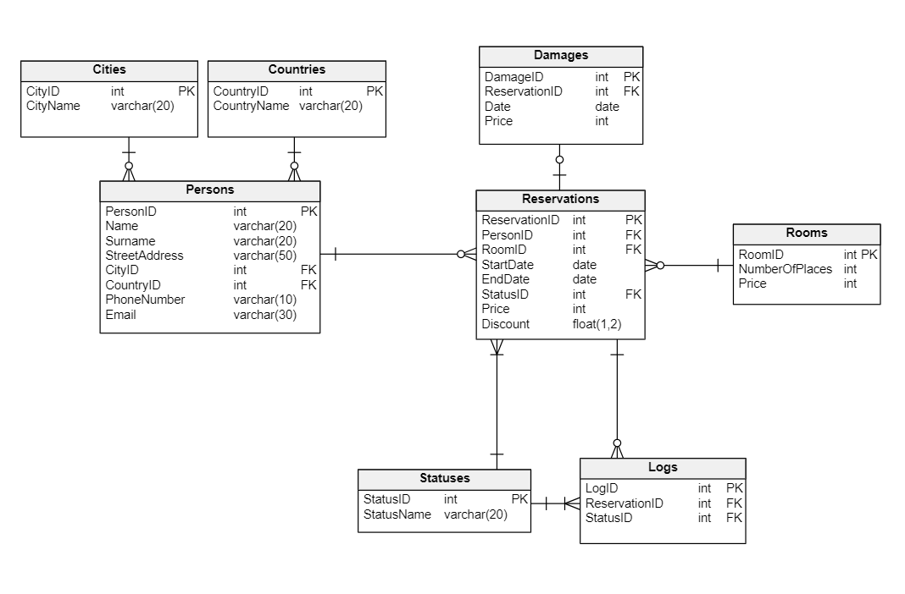
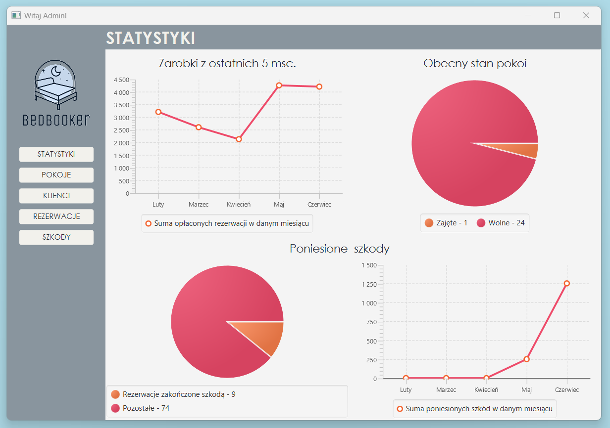
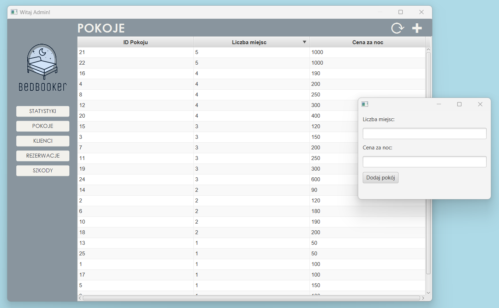
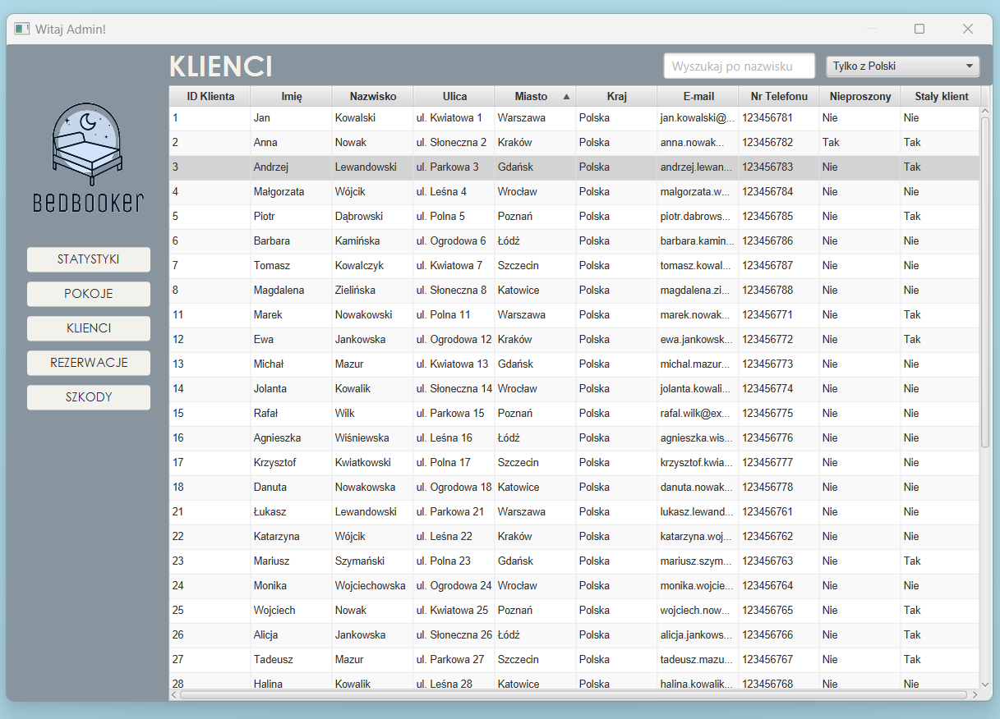
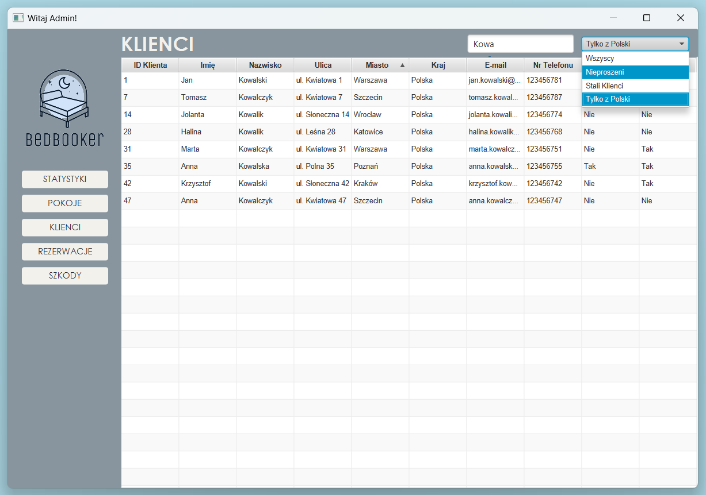
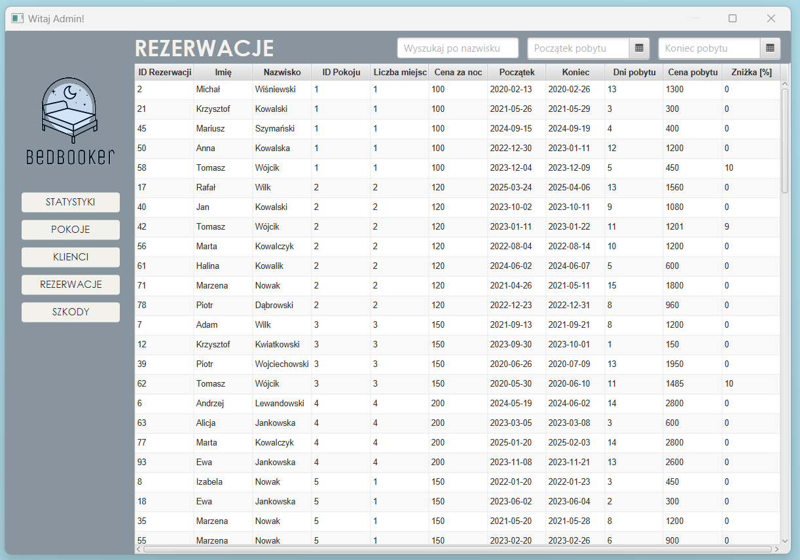
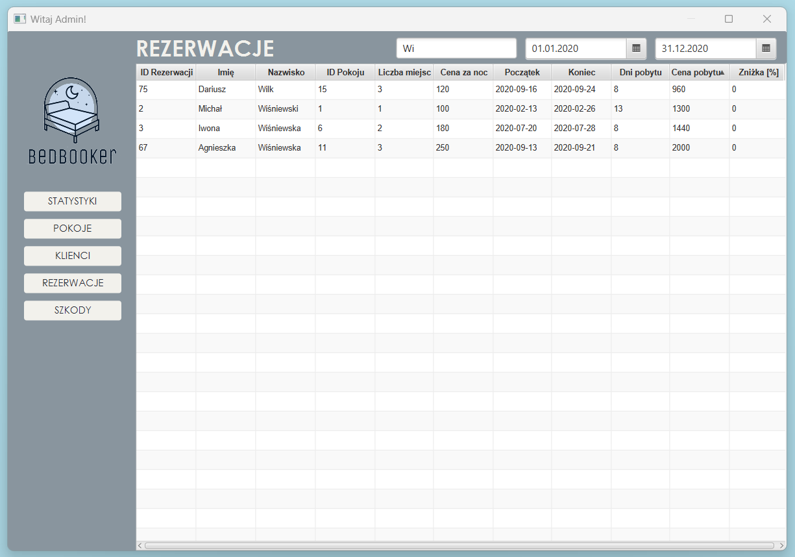
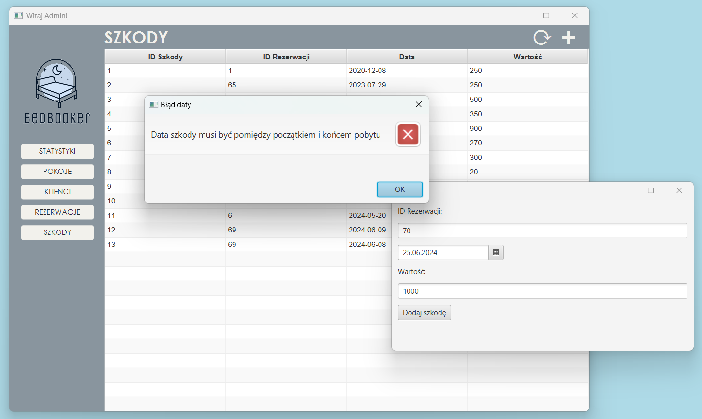

# MiniProjekt BedBooker

BedBooker to narzędzie ułatwiające zarządzanie hotelem. Jego głównym zastosowaniem jest obsługa bazodanowa rezerwacji. Projekt tworzony jest przy pomocy MySQL oraz Javy.

---

Imiona i nazwiska autorów : Gabriela Dumańska, Katarzyna Lisiecka

---

# Tabele



- `Persons`  - osoby

  - `PersonID` - identyfikator, klucz główny
  - `Name` - imię
  - `Surname` - nazwisko
  - `StreetAddress` - adres
  - `CityID` -  identyfikator miasta, klucz obcy
  - `CountryID` -  identyfikator kraju, klucz obcy
  - `PhoneNumber` -  numer telefonu
  - `Email` - adres e-mail

- `Cities` - słownik miast
  - `CityID` - identyfikator, klucz główny
  - `CityName` - nazwa miasta

- `Countries` - słownik państw
  - `CountryID` - identyfikator, klucz główny
  - `CountryName` - nazwa państwa

- `Rooms` - pokoje
  - `RoomID` - identyfikator, klucz główny
  - `NumberOfPlaces` - liczba miejsc
  - `Price` - cena za pokój za dobę hotelową

- `Reservations`  - rezerwacje

  - `ReservationID` - identyfikator, klucz główny
  - `PersonID` - identyfikator osoby, klucz obcy
  - `RoomID` - identyfikator pokoju, klucz obcy
  - `StartDate` - początek pobytu
  - `EndDate` -  koniec pobytu
  - `StatusID` -  identyfikator statusu, klucz obcy
  - `Price` -  cena rezerwacji
  - `Discount` - zniżka

- `Damages` - pokoje
  - `DamageID` - identyfikator, klucz główny
  - `ReservationID` - identyfikator rezerwacji, klucz obcy
  - `Date` - data zniszczenia
  - `Price` - wartość szkód

- `Logs` - dziennik zmian statusów rezerwacji

  - `LogID` - identyfikator, klucz główny
  - `ReservationID` - identyfikator rezerwacji, klucz obcy
  - `StatusID` - identyfikator statusu, klucz obcy
  - `Date` - data zmiany

- `Statuses` - słownik statusów
  - `StatusID` - identyfikator, klucz główny
  - `StatusName` - nazwa statusu- rezerwacja nowa, potwierdzona i zapłacona, anulowana
  
---
# Logowanie do systemu
 Widok administratora został zabezpieczony hasłem przed nieporządanymi działaniami.


# Widok administratora

Dla widoku administratora zaprojektowano kluczowe funkcje dla kontrolowania pracy hotelu.

  ## Statystyki



  Ten panel pomaga pracownikowi szybko zorietnować się w jakim stanie jest obecnie hotel.
  ### Zarobki z ostatnich 5 miesięcy
  Tę statystykę uzyskano korzystając z następującego widoku:
   
  ```mysql
    CREATE VIEW Earnings AS
      SELECT EXTRACT(YEAR FROM StartDate) AS Rok,
             EXTRACT(MONTH FROM StartDate) AS Miesiąc,
             SUM(Price * ((100 - Discount) / 100)) AS Zarobki
      FROM Reservations
        WHERE StatusID = 3 AND StartDate <= NOW()
        GROUP BY EXTRACT(YEAR FROM StartDate), EXTRACT(MONTH FROM StartDate)
        ORDER BY Rok DESC, Miesiąc DESC
        LIMIT 5;
  ```
  Zarobki to suma płatności za rezerwacje w danym miesiącu. Upewniono się, że liczone są rezerwacje jedynie opłacone- nieoczekujące, ani nieodwołane, czyli te ze statusem 3. Nie liczono również rezerwacji opłaconych, które się jeszcze nie odbyły.

  ### Obecny stan pokoi
  Ten wykres uzyskano z dwóch widoków- liczby pokoi obecni zamieszkałych oraz wszystkich pokoi.
  ```mysql
    CREATE VIEW NumberOfOccupiedRooms AS
      SELECT COUNT(res.ReservationID) AS OccupiedRoomCount
      FROM Rooms r
          LEFT JOIN Reservations res ON r.RoomID = res.RoomID
        WHERE res.StartDate <= CURDATE() AND res.EndDate >= CURDATE();
  ```
  ```mysql
    CREATE VIEW NumberOfRooms AS
      SELECT COUNT(r.RoomID) AS RoomCount
      FROM Rooms r
  ```
  W kolejnym punkcie w razie potrzeby wyciągnięcia dwóch liczb z bazy danych wykonano to w ramach jednego widoku, co uznano za lepsze rozwiązanie. 

  ### Poniesione szkody
  Pierwszy wykres kołowy to prosta statystyka unikalnych rezerwacji z tabeli Damages do pozostałych rezerwacji.
  
  ```mysql
    CREATE VIEW DamagesPerReservations AS
      SELECT
      (SELECT COUNT(DISTINCT ReservationID) FROM Damages) AS ReservationsWithDamages,
      (SELECT COUNT(ReservationID) FROM Reservations 
                                   WHERE EndDate < NOW()) AS UniqueReservations;
```
  Takie rozwiązanie wyciągania dwóch liczb uznano za bardziej czytelne- od razu wiadomo do czego są potrzebne. Redukuje to również liczbę widoków.

  Drugi wykres liniowy informuje o poniesionych szkodach w ostatich 5 miesiącach. W tym przypadku należało zmienić podejście względem statystki zarobków z ostatnich 5 miesięcy. Możemy się spodziewać, że w każdym miesiącu wystąpi chociaż jedna rezerwacja, więc wystarczyło z tabeli Reservations pogrupowane dane z ostatnich 5 miesięcy. Szkody nie muszą występować co miesiąc. Dlatego zastosowano inne podejście z zastosowaniem tabeli pomocniczej Miesiące.
  <br> <br> Tabela zawiera wszystkie miesiące od 2014 do 2034 w formacie np. '2024-06-01'
- `Miesiące` 
  - `Miesiąc` - typu date


  ```mysql
  CREATE VIEW SumOfDamages AS
    SELECT EXTRACT(YEAR FROM m.Miesiąc)  AS Rok,
         EXTRACT(MONTH FROM m.Miesiąc)   AS Miesiąc,
         COALESCE(SUM(d.Price), 0)       AS Szkody
    FROM Miesiące m 
        LEFT JOIN Damages d ON date_format(d.Date, '%Y-%m-01') = m.Miesiąc
      WHERE EXTRACT(YEAR FROM m.Miesiąc) <= YEAR(NOW())
        AND EXTRACT(MONTH FROM m.Miesiąc) <= MONTH(NOW())
      GROUP BY EXTRACT(YEAR FROM m.Miesiąc), m.Miesiąc
      ORDER BY EXTRACT(YEAR FROM m.Miesiąc) DESC,
               EXTRACT(MONTH FROM m.Miesiąc) DESC
      LIMIT 5;
  ```
---

  ## Pokoje
  To prosty ekran do przeglądania dostępnych pokoi oraz dodawania nowych. Przycisk plus ukazuje okno do dodawania nowych pokoi, a odświeżenie ładuje ponownie wyniki, by pokazywały się dodane na nowo pokoje. 

  

  Tabela pokoi to zwykły SELECT z tabeli Rooms. Dodawawanie pokoju obsługuje procedura:
  ```mysql
  CREATE PROCEDURE AddRoom(IN p_NumberOfPlaces int, IN p_Price int)
    BEGIN
        INSERT INTO Rooms (NumberOfPlaces, Price)
        VALUES (p_NumberOfPlaces, p_Price);
    END;
  ```
---

  ## Klienci
  Ekran z listą wszystkich klientów, którzy złożyli rezerwację w hotelu.

  

  Można wyszukiwać ich po nazwisku, po kilku filtrach oraz sortując dowolną kolumnę rosnąco lub malejąco.

  

  ```mysql
  CREATE VIEW CustomerFullInfo AS
    SELECT p.PersonID AS PersonID,
           p.Name     AS Name,
           p.Surname  AS Surname,
           p.StreetAddress AS Address,
           c.CountryName   AS Country,
           ci.CityName     AS City,
           p.PhoneNumber   AS PhoneNumber,
           p.Email         AS Email,
           (CASE WHEN rc.PersonID is not null
               THEN 'True' ELSE 'False' END)      AS IsRegular,
           (CASE WHEN bc.PersonID is not null 
               THEN 'True' ELSE 'False' END)      AS IsBanned
    FROM Persons p join Countries c on p.CountryID = c.CountryID 
                   join Cities ci on p.CityID = ci.CityID
                   left join RegularCustomers rc on p.PersonID = rc.PersonID
                   left join BannedCustomers bc on p.PersonID = bc.PersonID;
  ```
Klienci nieproszeni to tacy, którzy wykonali więcej niż 2 szkody lub na ponad 1000 złotych. Na tych klientów nie można złożyć rezerwacji.
```mysql
CREATE VIEW BannedCustomers AS
  SELECT P.PersonID        AS PersonID,
         P.Name            AS Name,
         P.Surname         AS Surname,
         COUNT(D.DamageID) AS DamageCount,
         SUM(D.Price)      AS TotalDamage
  FROM Persons P join Reservations R on P.PersonID = R.PersonID
                 join Damages D on R.ReservationID = D.ReservationID
    GROUP BY P.PersonID, P.Name, P.Surname
    HAVING (COUNT(D.DamageID) > 2) or (SUM(D.Price) > 1000);
```
Stali klienci złożyli więcej niż 4 rezerwacje lub wydali w hotelu więcej niż 3000 złotych. Naliczany jest dla nich rabat procentowy na kolejne rezerwacje.

```mysql
CREATE VIEW RegularCustomers AS
  SELECT P.PersonID                         AS PersonID,
         P.Name                             AS Name,
         P.Surname                          AS Surname,
         COUNT(R.ReservationID)             AS ReservationCount,
         SUM(R.Price)                       AS TotalReservationPrice,
         (4 + floor((SUM(R.Price) / 1000))) AS Discount
  FROM Persons P JOIN Reservations R on P.PersonID = R.PersonID
    GROUP BY P.PersonID, P.Name, P.Surname
    HAVING (COUNT(R.ReservationID) > 4) OR (SUM(R.Price) > 3000);
```
---
## Rezerwacje
  Widok na wszystkie hotelowe rezerwacje.  

   

  Można wyszukiwać je po nazwisku klienta, po dacie pobytu oraz sortować każdą kolumnę. 
  
  

```mysql
CREATE VIEW ReservationDetails AS
SELECT R.ReservationID                                 AS ReservationID,
       P.Name                                          AS PersonName,
       P.Surname                                       AS PersonSurname,
       Ro.RoomID                                       AS RoomID,
       Ro.NumberOfPlaces                               AS NumberOfPlaces,
       Ro.Price                                        AS RoomPrice,
       R.StartDate                                     AS StartDate,
       R.EndDate                                       AS EndDate,
       (to_days(R.EndDate) - to_days(R.StartDate))     AS NumberOfDays,
       R.Price                                         AS ReservationPrice,
       R.Discount                                      AS Discount
FROM Reservations R JOIN Persons P on R.PersonID = P.PersonID
                    JOIN Rooms Ro on R.RoomID = Ro.RoomID;
```

Filtry nakładano poleceniem WHERE na tym widoku.

---
## Szkody
  

Panel szkód działa podobnie do panelu Pokoje. Również można dodawać nowe szkody, a następnie odświeżać listę. Jednak tym razem należało wprowadzić kontrolę wprowadzanych danych.

```mysql
CREATE PROCEDURE AddDamage(IN p_ReservationID int, IN p_Date date,
                           IN p_Price int)
BEGIN
    DECLARE v_StartDate DATE;
    DECLARE v_EndDate DATE;

    SELECT StartDate, EndDate INTO v_StartDate, v_EndDate
    FROM Reservations
        WHERE ReservationID = p_ReservationID;

    IF v_StartDate IS NULL THEN
        SIGNAL SQLSTATE '45000'
        SET MESSAGE_TEXT = 'Nie istnieje rezerwacja o podanym ReservationID';
    END IF;

    IF p_Date < v_StartDate OR p_Date > v_EndDate THEN
        SIGNAL SQLSTATE '45001'
        SET MESSAGE_TEXT = 'Data szkody musi być pomiędzy StartDate i EndDate rezerwacji';
    END IF;

    INSERT INTO Damages (ReservationID, Date, Price)
    VALUES (p_ReservationID, p_Date, p_Price);

END;
```

